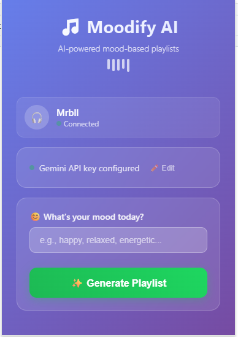
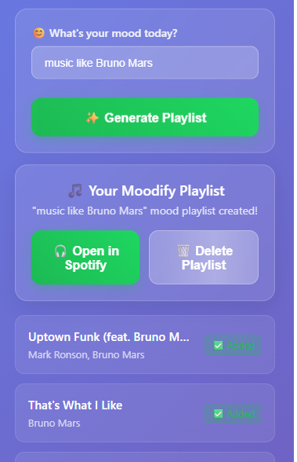
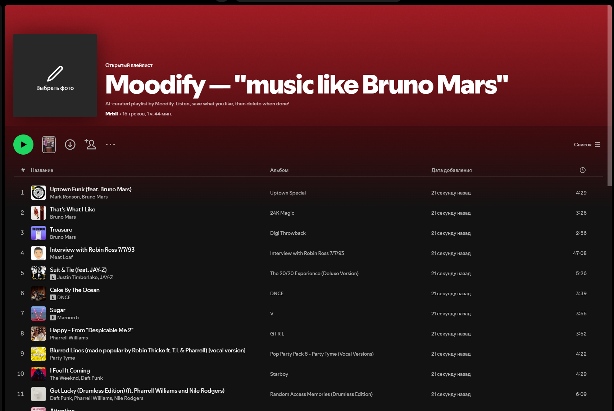

# 🎧 Moodify AI

> AI-powered Chrome extension that generates mood-based playlists using Gemini and Spotify.

**Moodify AI** helps you generate Spotify playlists based on your mood using Google Gemini and allows you to preview and manage tracks directly from your browser.

---

## 🚀 Features

- 🔐 Login with Spotify
- 💡 Mood-based playlist generation using Google Gemini
- 🔎 Spotify track search and preview
- ➕ Add songs to your playlists

---

## 📸 Screenshots





---

## 🛠 Installation

1. Clone or download this repo 
2. Open `chrome://extensions/` in the upper right corner
3. Enable "Developer mode"
4. Click "Load unpacked"
5. Select the `moodify-ai/` folder

---

## ⚙️ Setup

### 🔑 Google Gemini API Key

1. Get your API key at [https://aistudio.google.com/apikey](https://aistudio.google.com/apikey)
2. Paste it in the extension settings after installation

---

## 🧩 Tech Stack

- JavaScript
- Chrome Extensions API (Manifest V3)
- Spotify Web API
- Google Gemini API

---

## 📦 Folder Structure

```text
spotify-mood-extension/
├── public/                       # Static assets (icons, screenshots, etc.)
├── src/
│   ├── api/                      # External API integrations
│   │   ├── gemini.js             # Google Gemini API requests
│   │   └── spotify.js            # Spotify API requests
│   │
│   ├── background/               # Service worker logic (auth, tokens, background tasks)
│   │   └── index.js
│   │
│   ├── components/               # Reusable UI components
│   │   ├── modal.js              # Modal popups
│   │   └── playlist.js           # Playlist rendering and interactions
│   │
│   ├── popup/                    # Main extension popup UI
│   │   ├── index.js              # UI logic for popup
│   │   └── popup.html            # HTML structure
│   │
│   ├── storage/                  # Storage helpers (chrome.storage)
│   │   └── index.js
│   │
│   ├── styles/                   # CSS styles
│   │   └── main.css
│   │
│   └── utils/                    # Utility functions
│       ├── auth.js              # PKCE generation and token helpers
│       └── ui.js                # UI helpers (loading state, show/hide, etc.)
│
├── LICENSE                       # MIT License
├── manifest.json                 # Chrome extension manifest (v3)
└── README.md                     # Project documentation
```

---

## 📄 License

MIT — [LICENSE](./LICENSE)

---

## ❤️ Contributing

PRs welcome! Feel free to open issues or submit improvements.